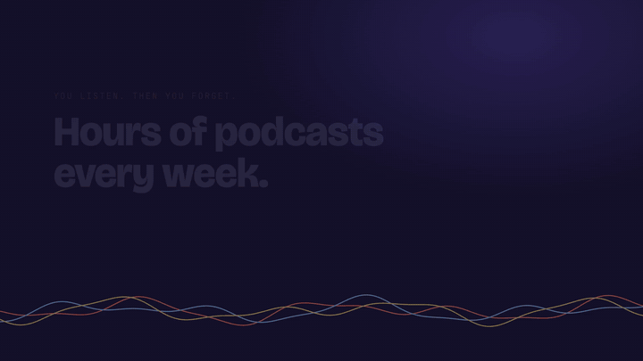

# Podcast Wiki

A Karpathy-style LLM wiki built from the podcasts I listen to on Spotify, written and maintained by [Claude Code](https://claude.com/claude-code).

Every episode I finish gets transcribed, and Claude folds what it taught into **concept pages**, one page per topic, synthesized across every episode that touched it, with disagreements between guests kept side by side. You stop remembering *an episode* and start knowing *a topic*.

[](promo/podcast-wiki-promo.mp4)

*Click for the full video with sound.*

## How it works

```
Spotify (episodes I've heard)
   │  tools/spotify_mcp.py
   ▼
raw/<show>/<date>-<slug>.md          ← transcript: published → Whisper → episode description
   │  tools/fetch_transcript.py
   ▼
Claude Code follows the procedure in CLAUDE.md
   ▼
wiki/  concepts · hubs · episodes · people · shows · takeaways
```

1. **List:** an MCP server reads the episodes I've played from the shows I follow.
2. **Fetch:** for each new episode, use the published transcript if there is one. Otherwise transcribe the audio locally with [mlx-whisper](https://github.com/ml-explore/mlx-examples/tree/main/whisper). The Spotify description is the last fallback.
3. **Synthesize:** Claude extends existing concept pages rather than creating near-duplicates. It rewrites each summary to integrate the new episode, links every claim to its episode and speaker, and records conflicting claims under *Disagreements*.
4. **Act:** actionable items go to a checklist grouped by domain, and recommended books, tools and people go to a recommendations list.

Hebrew episodes are translated to English during synthesis.

## What's inside

| | |
|---|---|
| [`wiki/index.md`](wiki/index.md) | Every page, grouped by domain. Start here. |
| [`wiki/concepts/`](wiki/concepts) | One topic each (e.g. harness engineering, LLM evals, index investing). |
| [`wiki/hubs/`](wiki/hubs) | Domain overviews: AI engineering, investing, knowledge management. |
| [`wiki/takeaways/to-try.md`](wiki/takeaways/to-try.md) | Actionable checklist, grouped by hub. |
| [`wiki/takeaways/recommendations.md`](wiki/takeaways/recommendations.md) | Books, tools and people worth following. |
| `wiki/episodes/`, `wiki/people/`, `wiki/shows/` | Short source notes that the concepts link back to. |

The wiki is plain Markdown with Obsidian wikilinks (`[[concepts/zone-2-training]]`), so it opens as an [Obsidian](https://obsidian.md) vault with a working graph view.

> **Note:** `raw/` (the full transcripts) is kept local and is not in this repo. Those transcripts are the podcasters' content; the wiki is a synthesis in my own words, linking back to each episode on Spotify.

## Install as a Claude Code plugin

Requires macOS on Apple Silicon, [uv](https://docs.astral.sh/uv/), `ffmpeg`, and a Spotify account. In Claude Code:

```
/plugin marketplace add HagaiHen/podcast-wiki
/plugin install podcast-wiki@podcast-wiki
```

Then open Claude Code in an empty folder and run `/podcast-wiki:setup`. It copies the tools, creates `wiki/`, and walks you through the Spotify login. After that, `/podcast-wiki:ingest-podcasts` builds your wiki.

## Run it yourself

Requires macOS on Apple Silicon (for mlx-whisper), [uv](https://docs.astral.sh/uv/), `ffmpeg`, and [Claude Code](https://claude.com/claude-code).

1. Create an app at the [Spotify developer dashboard](https://developer.spotify.com/dashboard) with redirect URI `http://127.0.0.1:8888/callback`.
2. `cp .env.example .env` and set `SPOTIFY_CLIENT_ID`. No client secret is needed because the login uses PKCE.
3. `uv run tools/spotify_mcp.py --auth` to log in to Spotify once.
4. Update the absolute paths in `.mcp.json` to your checkout.
5. In Claude Code, run `/ingest-podcasts`.

| Command | What it does |
|---|---|
| `/ingest-podcasts` | Full pipeline: list heard episodes → fetch text → update the wiki → commit → push. |
| `/lint-wiki` | Health check: broken links, orphans, drift between pages; fixes what it finds. |
| `/dream` | Consolidates Claude's project memory and merges duplicate concept pages. |
| `uv run tools/fetch_transcript.py --pending` | Raw files not yet in the wiki. |
| `uv run tools/lint_wiki.py` | Mechanical wiki checks only. |

**Unattended:** `tools/scheduled_ingest.sh` runs the pipeline headless. `tools/com.user.podcast-wiki.plist` is a launchd job that runs it every 6 hours; fix its paths, copy it to `~/Library/LaunchAgents/`, and `launchctl load` it. Because the headless Claude reads untrusted transcripts, it may only write inside `wiki/` and runs no git itself. The script commits and pushes afterwards.

`CLAUDE.md` holds the conventions, page templates and the step-by-step wiki update procedure Claude follows.
